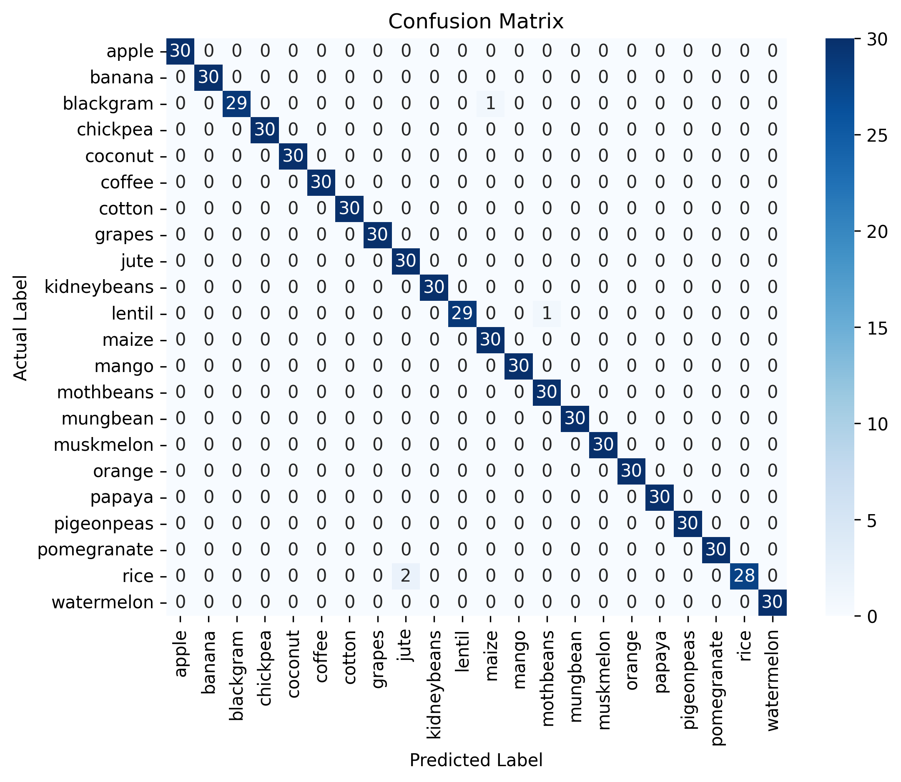
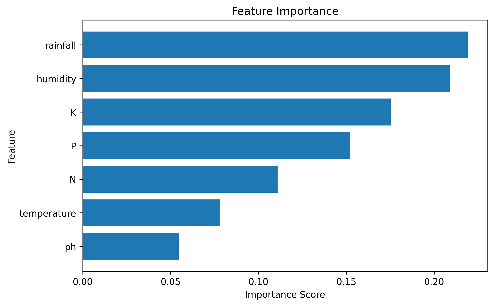

# 🌾 Crop Recommendation System using Machine Learning

This project is a **machine learning–based crop recommendation system** that suggests the most suitable crop to grow based on soil and environmental conditions.
It helps farmers and agricultural planners make **data-driven decisions** to improve productivity.

Now deployed as a **live REST API** using FastAPI + Docker, so predictions can be requested from any app, website, or service — not just inside a notebook.

---

## 🚀 Features
- Predicts the best crop based on:
  - Nitrogen (N)
  - Phosphorus (P)
  - Potassium (K)
  - Humidity
  - Rainfall
- Trained using supervised machine learning (Random Forest Classifier)
- Implemented in **Python** using **Jupyter Notebook**
- Deployed as a live API using **FastAPI**, containerized with **Docker**, hosted on **Render**

---

## 🧠 Machine Learning Workflow
1. Data Loading
2. Data Preprocessing
3. Exploratory Data Analysis (EDA)
4. Feature Selection
5. Model Training
6. Model Evaluation
7. Prediction
8. Deployment (API + Docker + Cloud hosting)

---

## 🛠️ Technologies Used
- Python 🐍
- NumPy
- Pandas
- Matplotlib / Seaborn
- Scikit-learn
- Jupyter Notebook
- **FastAPI** — serving the model as a REST API
- **Uvicorn** — ASGI server running the API
- **Docker** — containerizing the app for consistent deployment
- **Render** — cloud hosting for the live API

---

## 📂 Project Structure
```
├── Crop_Model.ipynb                        # Main notebook (model building & training)
├── src/
│   ├── train.py                             # Model training script
│   └── predict.py                           # CLI prediction script
├── app.py                                   # FastAPI app serving the model
├── Dockerfile                               # Container build instructions
├── requirements.txt                         # Project dependencies
├── Random_forest_model_Intelligence.pkl     # Trained model (generated by train.py)
├── label_Encoded_Intelligence.pkl           # Label encoder (generated by train.py)
├── README.md                                # Project documentation
├── .gitignore                               # Files ignored by Git
└── images/
    ├── confusion_matrix.png
    └── feature_importance.png
```

---

## 📊 Model Performance

### Confusion Matrix


### Feature Importance


---

## ⚙️ Installation & Setup (Notebook / Training)

### 1️⃣ Clone the repository
```bash
git clone https://github.com/naveenkumar200628/crop-recommendation-ml.git
cd crop-recommendation-ml
```

### 2️⃣ Create a virtual environment (optional but recommended)
```bash
python -m venv venv
source venv/bin/activate   # Windows: venv\Scripts\activate
```

### 3️⃣ Install dependencies
```bash
pip install -r requirements.txt
```

### 4️⃣ Run the notebook
```bash
jupyter notebook
```
Open `Crop_Model.ipynb` and run all cells to reproduce training, or run `src/train.py` directly to regenerate the `.pkl` model files.

---

## 🌐 Deployment — Running the API

The trained model is served through a FastAPI app (`app.py`), which exposes a `/predict` endpoint.

### Option A — Run locally with Python
```bash
pip install -r requirements.txt
uvicorn app:app --reload
```
Visit **http://127.0.0.1:8000/docs** for an interactive test page.

### Option B — Run with Docker (recommended, matches production)
```bash
docker build -t crop-recommendation .
docker run -d -p 8000:8000 --name crop-api-live crop-recommendation
```
Then visit **http://127.0.0.1:8000/docs**

### Example API Request
```bash
curl -X POST "http://127.0.0.1:8000/predict" \
  -H "Content-Type: application/json" \
  -d '{"N": 90, "P": 42, "K": 43, "humidity": 82, "rainfall": 202.9}'
```

**Response:**
```json
{"recommended_crop": "rice", "confidence": 0.95}
```

### Live Deployment
This API is containerized and deployed on **Render**, giving it a permanent public URL:

```
🔗 Live API: https://crop-recommendation-ml.onrender.com/docs
```
*(update this link once your Render deployment is live)*

---

## 📊 Model Output Example

| Input                                    | Output |
|-------------------------------------------|--------|
| N=90, P=42, K=43, Humidity=82, Rainfall=202.9 | Rice   |

---

## 👨‍💻 Author

**Naveen Kumar**
BCA – Data Science
VELS University